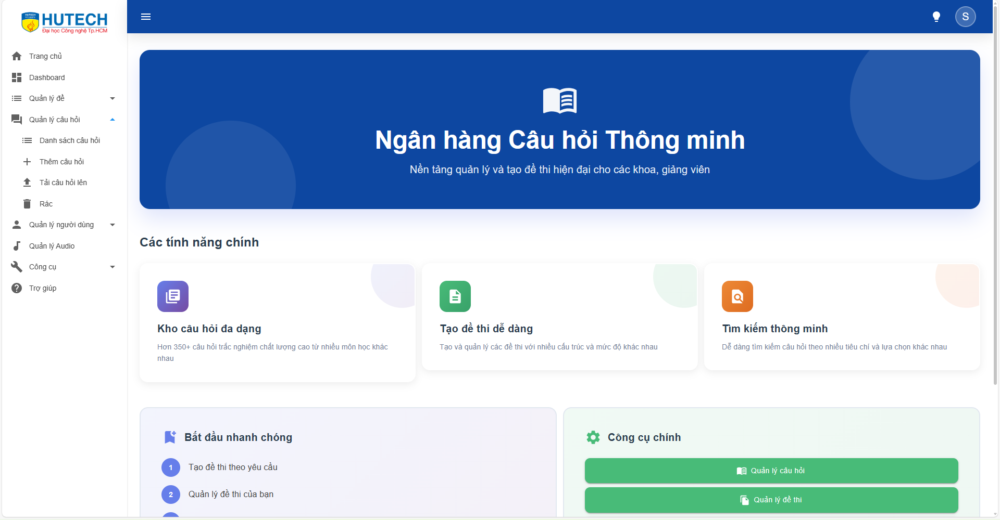
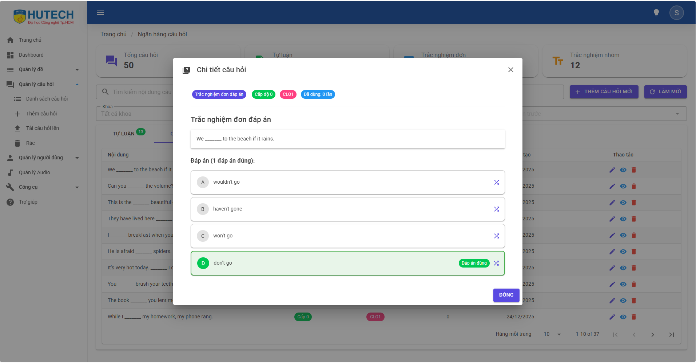
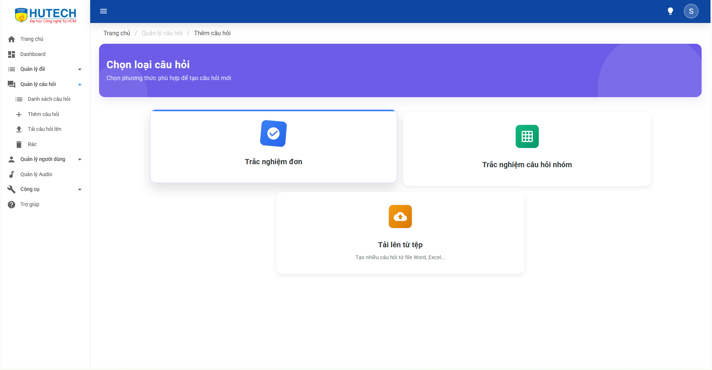
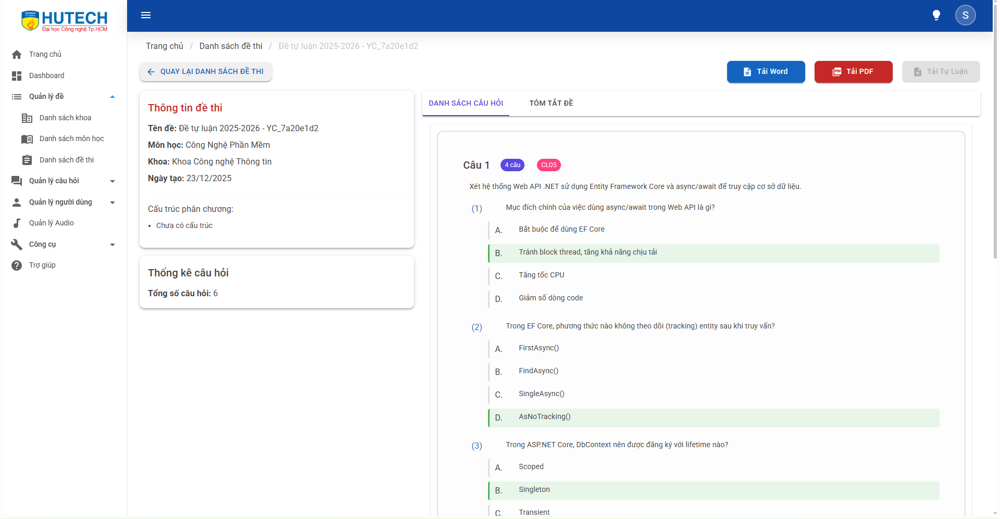
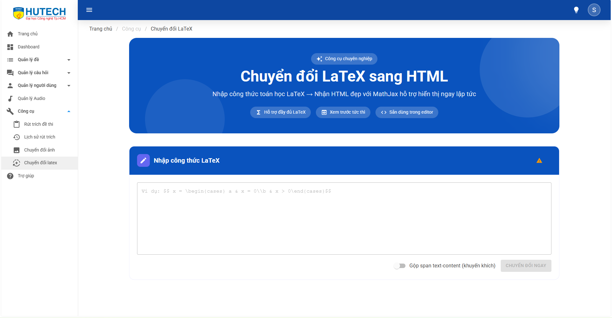

<p align="center">
   <a href="#">
      
   </a>
</p>

<p align="center">
    Question Bank Management System
</p>

<p align="center">
  
  
  
  
  
</p>

<p>
    A comprehensive solution for managing question banks, exam creation, and training management, built on the modern Clean Architecture. The system supports a closed-loop process from question data entry and subject/department management to exam matrix extraction and publication.
</p>




## Key Features

1. Question Bank Management
    - Diverse Question Types: Support for Multiple Choice, Essay, Fill-in-the-Blank, Matching, and Group Questions.
   
    - Mathematical Formula Authoring: Integration of a professional LaTeX editor directly into the web interface (LaTeX Editor, LaTeX Content).
   
    - Detailed Classification: Management by Faculty, Subject, Section (Chapter), and Difficulty Level.
   
    - Smart Import/Export:

        - Bulk import of questions from Excel files.

        - Management of attachments (images, audio) for each question.
2. Exam Management & Extraction
   - Exam Blueprint: Create exams based on a knowledge matrix (number of questions, difficulty level, and chapters).

   - Automatic Generation: Algorithms for randomizing questions and answers to generate multiple exam versions.

   - Document Publishing:

     - Export exams to Word (.docx) files based on standard templates (including support for HUTECH templates).

     - Export answer sheets and detailed answer keys.
3. Systems & Security
   - Security: User authentication using JWT (JSON Web Token) and Refresh Tokens.

   - Data Management: Use of Entity Framework Core with PostgreSQL to ensure data integrity.

## Tech Stack

The project is divided into two main parts: Backend (API) and Frontend (Client), sharing models through a Shared library.

Backend (BeQuestionBank.API)

- Framework: ASP.NET Core 9.0 Web API

- Architecture: Clean Architecture (Domain – Core – Infrastructure – API)

- ORM: Entity Framework Core (Code First)

- Database: PostgreSQL

- Authentication: JWT Authentication & Authorization

- Office Tools: OpenXML libraries for Word/Excel export

Frontend (FEQuestionBank.Client)

- Framework: Blazor WebAssembly (Wasm) – C# running in the browser

- UI Library: Bootstrap & Custom CSS

Features:

- JavaScript Interop (for LaTeX rendering)

- Custom Authentication State Provider

- Component-based Architecture

Solution Structure:

- BeQuestionBank.Domain: Contains entities (Question, Exam, User, etc.) and interfaces

- BeQuestionBank.Core: Contains business logic and services (QuestionService, ExamService, etc.)

- BeQuestionBank.Shared: Contains shared DTOs, enums, and constants for both backend and frontend

- BeQuestionBank.API: Entry point, controllers, and dependency injection configuration

- FEQuestionBank.Client: Blazor-based user interface

## Installation & Running the Project (Getting Started)

System Requirements

- .NET 9 SDK

- PostgreSQL (or SQL Server, depending on configuration)

- Visual Studio 2022 or VS Code

Installation Steps

Clone the repository:

```sh
git clone https://github.com/username/be-question-bank.git
cd be-question-bank
```

Configure the Database:

- Open ``BeQuestionBank.API/appsettings.json``.

- Update ``ConnectionStrings:DefaultConnection`` to point to your database.

Initialize the Database (Migration):

Open a terminal in the ``BeQuestionBank.API`` directory or use the Package Manager Console:

```sh
dotnet ef database update
```

Run the Backend (API):

```sh
cd BeQuestionBank.API
dotnet run
```

The API will run at: ```https://localhost:5043``` (or a similar port).

Run the Frontend (Client):

Open another terminal:

```sh
cd FEQuestionBank.Client
dotnet run
```

Access the application in your browser at the displayed address (e.g. ``https://localhost:5273``).

## Project Structure

```
be-question-bank/
├── BeQuestionBank.API/          # API Controllers, Configs, Middlewares
├── BeQuestionBank.Core/         # Application Logic, Services, Migrations
├── BeQuestionBank.Domain/       # Enterprise Entities, Repository Interfaces
├── BeQuestionBank.Shared/       # DTOs, Enums, Shared Models
├── BeQuestionBank.Test/         # Unit Tests
├── FEQuestionBank.Client/       # Blazor WebAssembly Pages & Components
│   ├── Components/              # Các thành phần tái sử dụng (Dialog, LaTeX...)
│   ├── Pages/                   # Các trang chính (Dashboard, Exam, Question...)
│   ├── Services/                # API Client Services
│   └── wwwroot/                 # Static files (Images, CSS, JS)
└── BeQuestionBank.sln           # Solution file
```

## Demo Screenshots






## Contact us

Author: 
- Ngô Mạnh Hùng - sundayy.dev@gmail.com
- Lê Hoài Huân - lehoaihuan@gmail.com
- Lê Hữu Duy Hoàng - duyhoanggl98@gmail.com

## License

This project is distributed under license [MIT](./LICENSE).
